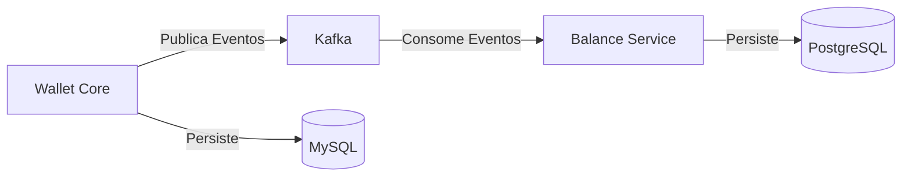

# Event-Driven Architecture Challenge

Este projeto demonstra uma arquitetura orientada a eventos (EDA) com dois microsserviços:
- **Wallet Core Service** (Go): Gerencia transações e carteiras
- **Balance Service** (Node.js/TypeScript): Mantém saldos atualizados via eventos Kafka

## Arquitetura



## Pré-requisitos

- Docker
- Docker Compose
- Porta 8085 (Wallet API)
- Porta 3003 (Balance API)
- Porta 8080 (Kafka UI)

## Iniciando o Projeto

1. Clone o repositório
2. Navegue até a pasta do projeto:
```bash
cd 13-EDA-EventDrivenArchitecture/fc-eda
```

3. Inicie os serviços com dados iniciais:
```bash
docker compose --profile init up -d
```

Este comando inicia:
- 🔷 Wallet Core Service (Go)
- 🔶 Balance Service (Node.js)
- 📬 Kafka & Zookeeper
- 🗄️ MySQL (Wallet Database)
- 🗃️ PostgreSQL (Balance Database)
- 📊 Kafka UI
- 🔧 Container de inicialização (cria dados de teste)

## Monitorando a Inicialização

### Logs do Container de Inicialização
```bash
docker logs -f eda-init-data
```
Você verá a criação de:
- Clientes
- Contas
- Transações iniciais

### Logs do Balance Service
```bash
docker logs -f eda-balance-service
```
Você verá:
- Conexão com o Kafka estabelecida
- Eventos recebidos e processados
- Atualizações de saldo
- Logs de requisições HTTP
- Status das migrações do banco de dados

### Interface Kafka
Acesse: http://localhost:8080

Funcionalidades:
- Visualização de tópicos
- Monitoramento de produtores/consumidores
- Inspeção de mensagens
- Métricas em tempo real

## APIs Disponíveis

Arquivos de teste das APIs:
- [Wallet Core API Client](./wallet-core/wallet-core-client-api.http)
- [Balance Service API Client](./balance-service/balance-service-client-api.http)

### Balance Service (porta 3003)

#### Listar Todos os Saldos
```http
GET http://localhost:3003/balances
```
Resposta:
```json
[
  {
    "account_id": "8f4b2c9d-5a3e-4c1f-9d6b-8e7f2a1b3c4d",
    "amount": 1236.70
  }
]
```

#### Consultar Saldo Específico
```http
GET http://localhost:3003/balances/{account_id}
```
Resposta:
```json
{
  "account_id": "8f4b2c9d-5a3e-4c1f-9d6b-8e7f2a1b3c4d",
  "amount": 1236.70
}
```

### Wallet Core (porta 8085)

#### Criar Cliente
```http
POST http://localhost:8085/clients
Content-Type: application/json

{
    "name": "John Doe",
    "email": "john@example.com"
}
```

#### Criar Conta
```http
POST http://localhost:8085/accounts
Content-Type: application/json

{
    "client_id": "{client_id}",
    "initial_balance": 1000
}
```

#### Realizar Transação
```http
POST http://localhost:8085/transactions
Content-Type: application/json

{
    "account_id_from": "{account_id_from}",
    "account_id_to": "{account_id_to}",
    "amount": 100
}
```

## Eventos Kafka

O sistema utiliza dois tópicos principais:

### 1. transactions
Formato da mensagem:
```json
{
  "Name": "TransactionCreated",
  "Payload": {
    "id": "e835e812-de81-46ec-8ab6-4d14f906d5bb",
    "account_id_from": "8161a587-ec22-4bf8-9c9b-1eea762298e1",
    "account_id_to": "50253236-0778-477d-96fb-23253aff76e7",
    "amount": 100
  }
}
```

### 2. balances
Formato da mensagem:
```json
{
  "Name": "BalanceUpdated",
  "Payload": {
    "account_id_from": "8161a587-ec22-4bf8-9c9b-1eea762298e1",
    "account_id_to": "50253236-0778-477d-96fb-23253aff76e7",
    "balance_account_id_from": 1900,
    "balance_account_id_to": 1600
  }
}
```

## Desenvolvimento

### Estrutura do Projeto
```
.
├── balance-service/       # Serviço de Saldos (Node.js)
│   ├── src/
│   ├── scripts/
│   └── Dockerfile
├── internal/             # Código Go do Wallet Core
├── pkg/                  # Pacotes compartilhados Go
├── sql/                 # Migrações SQL
└── docker-compose.yaml  # Configuração dos serviços
```

### Fluxo de Dados
1. Usuário cria transação via Wallet Core
2. Wallet Core publica eventos
3. Balance Service consome eventos
4. Saldos são atualizados automaticamente
5. Consultas disponíveis via API REST

## Troubleshooting

### Logs dos Serviços
```bash
# Balance Service
docker logs -f eda-balance-service

# Wallet Core
docker logs -f eda-goapp

# Kafka
docker logs -f eda-kafka
```

### Reiniciando Serviços
```bash
# Reiniciar tudo
docker compose down
docker compose --profile init up -d

# Reiniciar serviço específico
docker compose restart balance-service
``` 


## Descrição do Desafio

Olá Dev!

Agora que você entendeu os principais conceitos sobre microsserviços e da arquitetura baseada em eventos. Desenvolva um microsserviço em sua linguagem de preferência que seja capaz de receber via Kafka os eventos gerados pelo microsserviço "Wallet Core" e persistir no banco de dados os balances atualizados para cada conta.

Crie um endpoint: "/balances/{account_id}" que exibe o balance atualizado.

### Requisitos para entrega:
- Tudo deve rodar via Docker / Docker-compose
- Com um único docker-compose up -d todos os microsserviços, incluindo o da wallet core precisam estar disponíveis para que possamos fazer a correção.
- Não esqueça de rodar migrations e popular dados fictícios em ambos bancos de dados (wallet core e o microsserviço de balances) de forma automática quando os serviços subirem.
- Gere o arquivo ".http" para realizarmos as chamadas em seu microsserviço da mesma forma que fizemos no microsserviço "wallet core"
- Disponibilize o microsserviço na porta: 3003.

### Observações:
- Nosso objetivo com esse desafio não é corrigir seu código ou verificar a qualidade da sua aplicação, mas sim garantir que você teve o entendendimento da importância da produção e consumo de eventos.

- Nosso suporte nesse desafio vai até o escopo conceitual sobre o entendimento dos eventos e não entrará no mérito da análise de seu código, e é exatamente por isso que estamos permitindo que você utilize a linguagem de programação que você ache mais conveniente. 